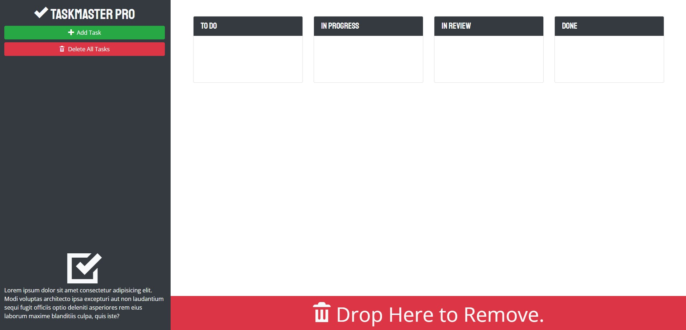

# Taskmaster Pro - Task Management Application

## Description
- This is a task management tool used to add and track tasks. Code has been created using jQuery, and Bootstrap to simplify and make UI/UX more user friendly. The applciation features a clean interface and an improved user experience and draggable functionality to update or delete tasks.

## Deployed link
- Please click on the link below to access the application 
- https://malickbax.github.io/taskmaster/

## Features 
- **Conditional Highlighting**: Tasks that are due in the next 3 days will appear yellow. Tasks that are in the past will appear red. All other tasks will appear in white.
- **Click and Drag**: To update the task's status, click and drag the task to a new status box. To sort tasks in a list, click and drag to move them into your desired order.

## Usage
- Select "Add Task" from the left viewer pane. A modal will open up. Enter task details (descriptio, due date) and select "Save Task" to save.
- Tasks appear in the "To Do" box. To update the task's status, click and drag the task to a new status box.
- To edit a task's text, click on the task body and it will turn into a textbox. Edit text and click outside of the box area to save. To edit the due date, click on the existing date and the calendar will pop back up. Select new date and changes will be applied.
- Deletea a task: To delete a task, click and drag to the red trash bin area. User can clear all tasks by clicking on the "Delete All Tasks" button.

## Screenshot

## Tests
- No test is required. Application is ready to use

## Questions
**Malick Ba**

For more projects, please visit my [GitHub page](https://github.com/malickbax) 
